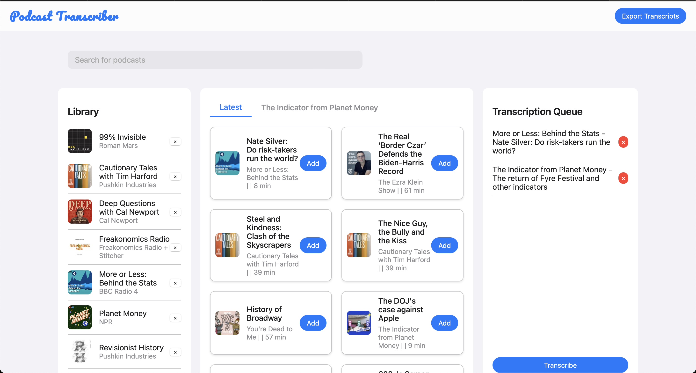

# Podcast Transcriber

Podcast Transcriber is a powerful application that automates the process of transcribing podcast episodes. It fetches podcast RSS feeds, downloads new episodes, transcribes them, and stores the transcriptions in a database.

## Features

- Automatic podcast RSS feed parsing
- Episode downloading
- Audio transcription using advanced speech-to-text technology (Whisper from OpenAI)
- Database storage of transcriptions
- Backup functionality to Google BigQuery
- Export functionality to text files

## Screenshot



## Getting Started

### Prerequisites

- Python 3.8+
- FFmpeg

### Installation

1. Clone the repository:
   ```
   git clone https://github.com/yourusername/podcast-transcriber.git
   cd podcast-transcriber
   ```

2. Install the required Python packages:
   ```
   pip install -r requirements.txt
   ```

## Usage

### Starting the Application

To start the Podcast Transcriber in standalone mode, use the provided bash script:

```bash
cd podcast_transcriber
./podcast-transcriber.sh
```

This script will:
1. Activate the virtual environment
2. Run the Django management command to start the application

To make it executable from anywhere in the terminal, run the following commands:

```bash
chmod +x podcast-transcriber.sh
sudo ln -s $PWD/podcast-transcriber.sh /usr/local/bin/podcast-transcriber
```

### Backing Up to BigQuery

If you wish to export the transcripts to a BigQuery table, open `export_transcripts_to_bq.py` and set the following variables: 

```
BIGQUERY_TABLE_ID='your-project-id.dataset.table'
CREDENTIALS_PATH='path/to/your/credentials.json'
```

To begin the export, use the following script:

```bash
./export_transcripts_to_bq.sh
```

This script will:
1. Activate the virtual environment
2. Execute the `export_transcripts_to_bq.py` script to export the transcripts to BigQuery

To run the script as a cron job, use the following command:

```bash
crontab -e
```

Add the following line to the end of the file:

```bash
0 0 * * * /bin/bash $PWD/export-transcripts-to-bq.sh >> $PWD/logs/export-transcripts-to-bq.log 2>&1
```

This will run the script at midnight every day. Adjust the time as needed.

Make sure you have properly configured your Google Cloud credentials before running this script.

## Contributing

Contributions are welcome! Please feel free to submit a Pull Request.

## License

This project is licensed under the MIT License - see the [LICENSE](LICENSE) file for details.

## Acknowledgments

- [FFmpeg](https://ffmpeg.org/) for audio processing
- [Django](https://www.djangoproject.com/) for the web framework
- [whisper.cpp](https://github.com/ggerganov/whisper.cpp) for the speech-to-text model
